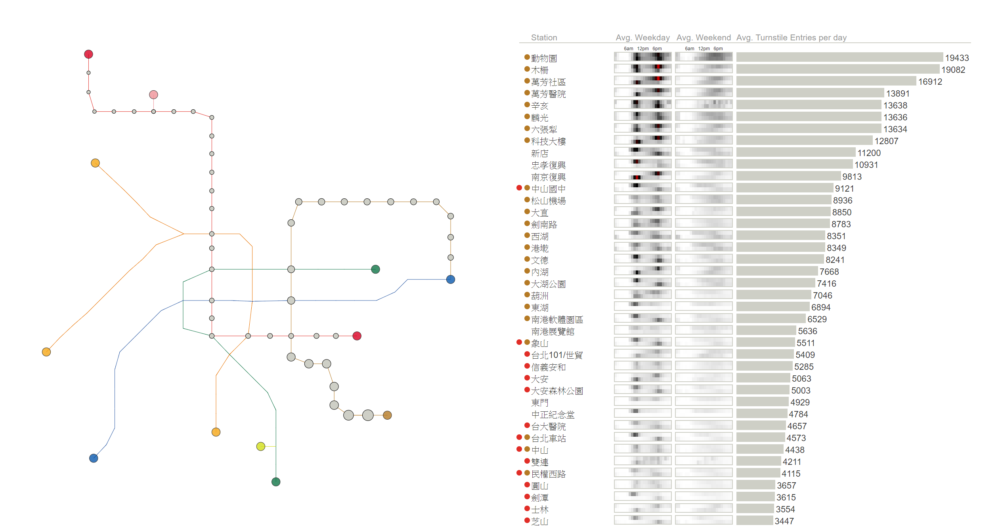

# 台灣捷運mbta圖展示

## Quick Start

1. Install [node.js](http://nodejs.org/)
2. Install `bower` to grab dependencies and `http-server` to run the website

     `npm install -g bower http-server`
 
3. Install dependencies

     `bower install`

4. Serve up the website

    `http-server`

5. Browse to [http://localhost:8080/](http://localhost:8080/) to see the visualization